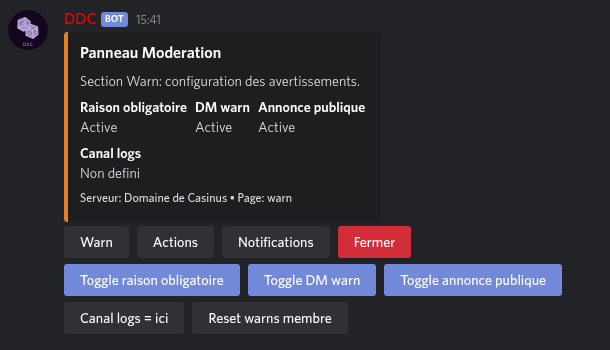
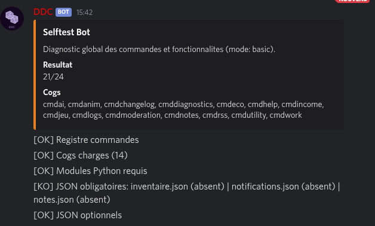

# DDCBot 🤖

[](https://github.com/Estemobs/ddcbot/actions/workflows/tests.yml)
[](LICENSE)
[](requirements.txt)
[](https://github.com/Rapptz/discord.py)

Bot Discord francophone tout-en-un : modération, économie/travail, mini-jeux, notifications RSS, logs, notes/tags, assistant IA, auto-moderation par IA, tickets de support, webhooks, mode lockdown et auto-diagnostic — le tout piloté par des panneaux d'administration en un clic ou via un dashboard web.

<p align="center">
  
</p>

## Sommaire

- [Fonctionnalités](#fonctionnalités)
- [Dashboard Web](#dashboard-web)
- [Démarrage rapide avec Docker (recommandé)](#démarrage-rapide-avec-docker-recommandé)
- [Auto-mise à jour](#auto-mise-à-jour)
- [Installation manuelle (venv)](#installation-manuelle-venv)
- [Configuration](#configuration)
- [Commandes](#commandes)
- [Développement](#développement)
- [Licence](#licence)

## Fonctionnalités

| Module | Description |
|---|---|
| 🛡️ **Modération** | avertissements, sanctions, verrouillage de salons, panneau `,modpanel` |
| 💰 **Économie** | soldes, classement, transferts, historique `,transactions`, panneau `,ecopanel` |
| 💼 **Travail & revenus** | `,work` (config par serveur), revenus liés aux rôles, panneau `,incomepanel` |
| 🎮 **Mini-jeux & loot** | boutique, lots, quêtes, giveaways par réaction, panneau `,gamepanel` |
| 📰 **Notifications RSS** | suivi de sorties d'épisodes/animes via `,subscribe` (aiohttp + HTTPS) |
| 📝 **Notes & tags** | mémos textuels par serveur (`,addtag`, `,tag`, ...) |
| 🧠 **Assistant IA** | réponses et OCR via `g4f` / `easyocr`, rate-limit par utilisateur |
| 📋 **Logs** | salons et catégories de logs configurables par serveur, panneau `,logspanel` |
| 🌐 **Traduction** | `/translate` (éphémère, visible uniquement par l'auteur), langues `,lang`/`,guildlang` (fr/en) |
| 🎭 **Reaction roles** | attribue un rôle par réaction (`reactrole`) |
| 📈 **Leveling** | XP par message, `,rank`, `,levels`, config `,xpconfig` |
| 👋 **Accueil** | messages de bienvenue/départ avec placeholders `,setwelcome`/`,setleave` |
| 🚫 **Auto-mod** | filtre de mots bannis (`,automod`, `,badword`) |
| ⏰ **Rappels** | `,rmd` persisté en base, `,reminders`, `,rmcancel` |
| 🩺 **Auto-diagnostic** | `,selftest` vérifie commandes, cogs, modules et tables SQLite |
| 🔄 **Changelog auto** | annonce les mises à jour du bot dans un salon Discord |
| 🛡️ **AI-Moderation** | modération intelligente par IA (g4f), détection de contenu toxique, actions automatiques `,aimod` |
| 🎫 **Tickets** | système de tickets de support avec salons privés et archivage `,ticket`, `,closeticket` |
| 🔗 **Webhooks** | notifications automatiques vers webhooks Discord pour joins/bans/warnings `,webhookset` |
| 🔒 **Lockdown** | mode urgence : verrouillage rapide de tous les salons `,lockdown`, `,unlockdown` |

<p align="center">
  
</p>

## Dashboard Web

DDCBot inclut un dashboard web d'administration basé sur FastAPI, accessible via un navigateur. Il permet de gérer toutes les configurations du bot sans passer par Discord.

### Fonctionnalités du dashboard

- **Accueil** : statistiques globales (serveurs, comptes, transactions, warnings)
- **Économie** : configuration, soldes, ajouter/retirer de l'argent, historique des transactions
- **Moderation** : configuration des warns, auto-timeout, reset par utilisateur
- **Leveling** : configuration XP/cooldown, classement, reset
- **Welcome/Leave** : messages de bienvenue/départ avec placeholders
- **AutoMod** : activation, gestion des mots bannis
- **Logs** : configuration des canaux et catégories
- **Notes** : CRUD complet des notes
- **Transactions** : historique global
- **Reminders** : rappels en attente
- **Giveaways** : actifs et terminés
- **API JSON** : `/api/guilds`, `/api/guild/{id}/economy`, `/api/stats`

### Lancement du dashboard

Le dashboard démarre automatiquement avec Docker (service `dashboard`). Pour le lancer manuellement :

```bash
python -m web_dashboard.main
```

Le dashboard sera accessible sur `http://<IP>:<DASHBOARD_PORT>` (par défaut `http://localhost:8080`).

### Configuration du dashboard

Dans le fichier `.env` :

```dotenv
DASHBOARD_HOST=0.0.0.0    # Adresse d'écoute (0.0.0.0 = toutes les interfaces)
DASHBOARD_PORT=8080        # Port du dashboard
```

## Démarrage rapide avec Docker (recommandé)

Prérequis : [Docker](https://docs.docker.com/get-docker/) et le plugin Compose (`docker compose version`).

```bash
git clone https://github.com/Estemobs/ddcbot.git
cd ddcbot
cp .env.example .env
```

Éditez `.env` et renseignez au minimum :

```dotenv
DDC_TOKEN=votre_token_discord
PROJECT_DIR=/chemin/absolu/vers/ddcbot   # ex: /home/vous/ddcbot
```

> `PROJECT_DIR` doit être le chemin **absolu sur la machine hôte** vers ce dossier cloné : le service d'auto-update pilote le démon Docker de l'hôte via `docker.sock`, il a donc besoin du vrai chemin hôte pour monter les volumes correctement.

Puis lancez tout :

```bash
docker compose up -d
```

Deux services démarrent :

- `ddcbot` : le bot lui-même
- `dashboard` : le dashboard web d'administration (port configurable via `DASHBOARD_PORT`)
- `updater` : surveille le dépôt Git et redéploie automatiquement le bot dès qu'un nouveau commit est poussé (voir ci-dessous)

Suivre les logs :

```bash
docker compose logs -f ddcbot
```

## Auto-mise à jour

Le service `updater` (défini dans [docker-compose.yml](docker-compose.yml) et [docker/updater](docker/updater)) :

1. vérifie toutes les `CHECK_INTERVAL` secondes (60s par défaut) si la branche `GIT_BRANCH` (par défaut `master`) a avancé sur GitHub ;
2. si oui : `git pull`, reconstruit l'image `ddcbot` et la redémarre (`docker compose up -d ddcbot`) ;
3. au redémarrage, le bot compare le commit courant au dernier commit annoncé et poste automatiquement un résumé des changements (`git log`) dans le salon Discord défini par `CHANGELOG_CHANNEL_ID` (optionnel — laissez vide pour désactiver l'annonce Discord, la commande `,changelog` reste disponible manuellement).

Aucun webhook public n'est requis : la surveillance se fait par sondage (polling) du dépôt distant, ce qui fonctionne même en auto-hébergement derrière un NAT.

## Installation manuelle (venv)

Pour du développement local sans Docker :

```bash
python3 -m venv .venv
source .venv/bin/activate
python -m pip install --upgrade pip
pip install -r requirements.txt
```

Configuration du token — deux options équivalentes :

- variable d'environnement `DDC_TOKEN` (utilisée en priorité) ; ou
- fichier `secrets.json` à la racine du projet :

```json
{
  "ddc_token": "VOTRE_TOKEN_DISCORD"
}
```

Lancement :

```bash
python main.py
```

## Configuration

| Fichier / variable | Rôle |
|---|---|
| `DDC_TOKEN` (env) ou `secrets.json` | Token du bot Discord |
| `CHANGELOG_CHANNEL_ID` (env) | Salon où poster le changelog automatique (optionnel) |
| `DASHBOARD_HOST`, `DASHBOARD_PORT` (env) | Adresse et port du dashboard web (optionnel) |
| `PROJECT_DIR`, `GIT_BRANCH`, `CHECK_INTERVAL` (env) | Utilisés uniquement par `docker-compose.yml` / le service `updater` |
| Tables `permission_config`, `moderation_config`, `economy_config`, `logs_config`, `ai_moderation_config`, `ticket_config`, `webhook_config`, `lockdown_config`, ... | Configuration par serveur, gérée via les panneaux `,*panel` |

Toutes les données du bot vivent dans une base **SQLite** unique, `data/ddcbot.sqlite3`, créée automatiquement au premier lancement (schéma défini dans [data/migrations/0001_initial.sql](data/migrations/0001_initial.sql)). Ce fichier est volontairement exclu du dépôt (`.gitignore`) : il contient de vrais identifiants de serveur/salon Discord et des soldes réels, et ne doit jamais être commité, pour éviter qu'un `git reset`/`git pull` n'écrase les données réelles d'un serveur.

> Si vous mettez à jour un checkout antérieur à la migration SQLite (qui avait encore des fichiers `data/*.json`), lancez une seule fois `python scripts/migrate_json_to_sqlite.py` pour importer vos anciennes données avant de redémarrer le bot.

## Commandes

Liste complète et à jour dans Discord via `,help`. Pour vérifier que toutes les commandes et fichiers requis sont bien en place : `,selftest` (ou `,selftest deep` pour un contrôle approfondi). `,version` affiche le hash du commit déployé ; `,changelog` affiche les derniers commits.

## Versioning

Le seul numéro de version du bot est le **hash du commit** de la branche déployée (HEAD). Il est affiché dans Discord via `,version` (et en pied de page de `,help` / `,changelog`), et correspond exactement au commit visible sur le miroir GitHub (`git rev-parse HEAD`). Aucun fichier de version n'est maintenu à la main.

## Développement

```bash
flake8 . --count --select=E9,F63,F7,F82 --show-source --statistics   # erreurs bloquantes (CI)
python -m compileall -q .                                            # vérification de syntaxe
pytest -q                                                             # suite de tests
```

Les cogs vivent dans [cogs/](cogs/) et la base SQLite / ses migrations dans [data/](data/) ; `main.py` reste à la racine. Voir [CLAUDE.md](CLAUDE.md) pour le détail de l'architecture (cogs, persistance SQLite, gate admin, diagnostics).

## Licence

Ce projet est sous licence [GNU General Public License v3.0](https://www.gnu.org/licenses/gpl-3.0.html) (GPL-3.0) : vous pouvez l'utiliser, le modifier et le redistribuer librement, à condition que toute version modifiée ou distribuée reste sous GPL-3.0 avec le code source. Voir le fichier [LICENSE](LICENSE) pour plus de détails.
