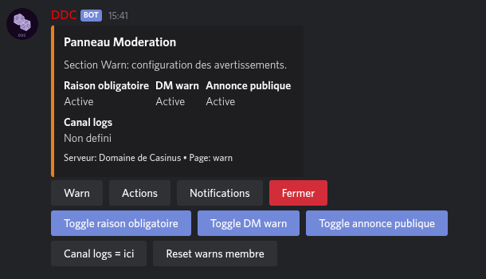
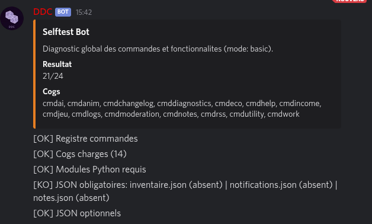

# DDCBot 🤖

[](https://github.com/Estemobs/ddcbot/actions/workflows/tests.yml)
[](LICENSE)
[](requirements.txt)
[](https://github.com/Rapptz/discord.py)

Bot Discord francophone tout-en-un : modération, économie/travail, mini-jeux, notifications RSS, logs, notes/tags, assistant IA et auto-diagnostic — le tout piloté par des panneaux d'administration en un clic.

<p align="center">
  
</p>

## Sommaire

- [Fonctionnalités](#fonctionnalités)
- [Démarrage rapide avec Docker (recommandé)](#démarrage-rapide-avec-docker-recommandé)
- [Auto-mise à jour](#auto-mise-à-jour)
- [Installation manuelle (venv)](#installation-manuelle-venv)
- [Configuration](#configuration)
- [Commandes](#commandes)
- [Développement](#développement)
- [Licence](#licence)

## Fonctionnalités

| Module | Description |
|---|---|
| 🛡️ **Modération** | avertissements, sanctions, verrouillage de salons, panneau `,modpanel` |
| 💰 **Économie** | soldes, classement, transferts, panneau `,ecopanel` |
| 💼 **Travail & revenus** | `,work`, revenus liés aux rôles, panneau `,incomepanel` |
| 🎮 **Mini-jeux & loot** | boutique, lots, quêtes, giveaways, panneau `,gamepanel` |
| 📰 **Notifications RSS** | suivi de sorties d'épisodes/animes via `,subscribe` |
| 📝 **Notes & tags** | mémos textuels par serveur (`,addtag`, `,tag`, ...) |
| 🧠 **Assistant IA** | réponses et OCR via `g4f` / `easyocr` |
| 📋 **Logs** | salons et catégories de logs configurables par serveur, panneau `,logspanel` |
| 🩺 **Auto-diagnostic** | `,selftest` vérifie commandes, cogs, modules et fichiers JSON |
| 🔄 **Changelog auto** | annonce les mises à jour du bot dans un salon Discord |

<p align="center">
  
</p>

## Démarrage rapide avec Docker (recommandé)

Prérequis : [Docker](https://docs.docker.com/get-docker/) et le plugin Compose (`docker compose version`).

```bash
git clone https://github.com/Estemobs/ddcbot.git
cd ddcbot
cp .env.example .env
```

Éditez `.env` et renseignez au minimum :

```dotenv
DDC_TOKEN=votre_token_discord
PROJECT_DIR=/chemin/absolu/vers/ddcbot   # ex: /home/vous/ddcbot
```

> `PROJECT_DIR` doit être le chemin **absolu sur la machine hôte** vers ce dossier cloné : le service d'auto-update pilote le démon Docker de l'hôte via `docker.sock`, il a donc besoin du vrai chemin hôte pour monter les volumes correctement.

Puis lancez tout :

```bash
docker compose up -d
```

Deux services démarrent :

- `ddcbot` : le bot lui-même
- `updater` : surveille le dépôt Git et redéploie automatiquement le bot dès qu'un nouveau commit est poussé (voir ci-dessous)

Suivre les logs :

```bash
docker compose logs -f ddcbot
```

## Auto-mise à jour

Le service `updater` (défini dans [docker-compose.yml](docker-compose.yml) et [docker/updater](docker/updater)) :

1. vérifie toutes les `CHECK_INTERVAL` secondes (60s par défaut) si la branche `GIT_BRANCH` (par défaut `master`) a avancé sur GitHub ;
2. si oui : `git pull`, reconstruit l'image `ddcbot` et la redémarre (`docker compose up -d ddcbot`) ;
3. au redémarrage, le bot compare le commit courant au dernier commit annoncé et poste automatiquement un résumé des changements (`git log`) dans le salon Discord défini par `CHANGELOG_CHANNEL_ID` (optionnel — laissez vide pour désactiver l'annonce Discord, la commande `,changelog` reste disponible manuellement).

Aucun webhook public n'est requis : la surveillance se fait par sondage (polling) du dépôt distant, ce qui fonctionne même en auto-hébergement derrière un NAT.

## Installation manuelle (venv)

Pour du développement local sans Docker :

```bash
python3 -m venv .venv
source .venv/bin/activate
python -m pip install --upgrade pip
pip install -r requirements.txt
```

Configuration du token — deux options équivalentes :

- variable d'environnement `DDC_TOKEN` (utilisée en priorité) ; ou
- fichier `secrets.json` à la racine du projet :

```json
{
  "ddc_token": "VOTRE_TOKEN_DISCORD"
}
```

Lancement :

```bash
python main.py
```

## Configuration

| Fichier / variable | Rôle |
|---|---|
| `DDC_TOKEN` (env) ou `secrets.json` | Token du bot Discord |
| `CHANGELOG_CHANNEL_ID` (env) | Salon où poster le changelog automatique (optionnel) |
| `PROJECT_DIR`, `GIT_BRANCH`, `CHECK_INTERVAL` (env) | Utilisés uniquement par `docker-compose.yml` / le service `updater` |
| `permission_config.json`, `moderation_config.json`, `economy_config.json`, `logs_config.json`, ... | Configuration par serveur, gérée via les panneaux `,*panel` |

Les fichiers de **données de jeu en production** (`balances.json`, `income.json`, `inventaire.json`, `quete.json`, `notifications.json`, `workconfig.json`, `warnconfig.json`, `notes.json`) sont volontairement exclus du dépôt (`.gitignore`) : ils sont créés automatiquement au premier lancement et ne doivent jamais être commités, pour éviter qu'un `git reset`/`git pull` n'écrase les données réelles d'un serveur. Chacun a un `*.example.json` versionné (ex. `balances.example.json`) montrant la structure attendue.

## Commandes

Liste complète et à jour dans Discord via `,help`. Pour vérifier que toutes les commandes et fichiers requis sont bien en place : `,selftest` (ou `,selftest deep` pour un contrôle approfondi).

## Développement

```bash
flake8 . --count --select=E9,F63,F7,F82 --show-source --statistics   # erreurs bloquantes (CI)
python -m compileall -q .                                            # vérification de syntaxe
pytest -q                                                             # suite de tests
```

Voir [CLAUDE.md](CLAUDE.md) pour le détail de l'architecture (cogs, persistance JSON, gate admin, diagnostics).

## Licence

Ce projet est sous licence [PolyForm Noncommercial 1.0.0](https://polyformproject.org/licenses/noncommercial/1.0.0), une licence source-available conçue pour le logiciel.
Utilisation commerciale interdite. Voir le fichier [LICENSE](LICENSE) pour plus de details.
